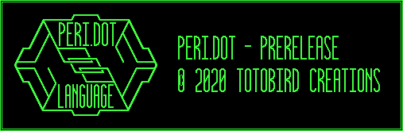

# Peri.dot



Peri.dot is a strongly typed interpreted language, with type inference, implemented in Python. The file extension is ".peri"


## "Installation"

This project uses submodules for known version of the python [click](https://click.palletsprojects.com/en/7.x/) and [colorama](https://pypi.org/project/colorama/) packages.


```bash
git clone https://github.com/toto-bird/Peri.dot.git
cd Peri.dot
git submodule init
git submodule update
```

## Usage 

```bash
python peridot file.peri`
```

## Running Unit Tests

Unit tests expect pytest.  (`pip install pytest`)
From the top level directory  `pytest`

## Current Features

* Basic REPL
* Types:
    * Null/None: `Null`
    * Numbers: `Int`, `Float`
    * Strings: `Str`
    * Booleans: `Bool`
    * Arrays: `Array`
    * Functions: `Function`
    * Exceptions: `Exception`
* Types must be explicitely cast:
    * `1 + 1` -> `2`
    * `1 + 1.0` -> `OperationError('Float can not be added to Int')`
* Variables:
    * Creation/Initialization: `var x = 2`
    * Assignment: `x = 5`
    * Accessing: `x`
* Arithmetic:
    * Addition: `1 + 2`
    * Subtraction: `5 - 1`
    * Multiplication: `10 * 2`
    * Division: `25 / 5`
    * Exponents: `2 ^ 3`
* Global comparisons:
    * Equals: `==`
    * Not Equals: `!=`
* Numeric comparisons:
    * Greater than: `>`
    * Less than: `<`
    * Greater than or equal to: `>=`
    * Less than or equal to `<=`
* Boolean operations: `and`, `or` and `not`
* Functions
    * Creation: `var add = func(a, b) {a + b}`
    * Calling: `add(2, 6)`
* Exception handler `var x = handler {10 / 0}`

## Coming Soon

* Improved repl
* Assert / in-peri.dot testing: `assert(x == 9, 'x is not equal to 9')`
* More types:
    * Dictionaries: `{'name': 'John', 'age': 47}`
* Improved exception type
* Importing other files: `include('./file.peri')`
* Function arguments and return values have to have an explicit type: `var add = func(a: int, b:int) > int {`
* Function default argument values: `var greet = func(name: str, emph=1) {print(name + ' ' + '!' * emph)}`
* Returning values from functions: `return(True)`
* If statement: `if x == 1 {var y = 3} elif x == 2 {var y = 2} else {var y = 1}`
* For and while loops: `for i in [True, True, False] {print(i)}`
* Built-in variables: `True`, `False`, `Null`
* Built-in functions: `Str()`, `print('Hello World!')`

## Possible Features
* Formatted strings `'Hello World{suffix}'`
* More operations:
    * Add and assign `+=`
    * Subtract and assign `-=`
    etc.