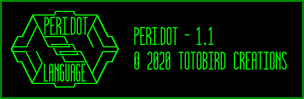

# Peri.dot



Peri.dot is a strongly typed dynamic language, with type inference, implemented in Python.  The file extension is ".peri"


## "Installation"

This project uses submodules for known version of the python [click](https://click.palletsprojects.com/en/7.x/) and [colorama](https://pypi.org/project/colorama/) packages.


```bash
git clone https://github.com/toto-bird/Peri.dot.git
cd Peri.dot
git submodule init
git submodule update
```

## Usage 

```bash
python peridot file.peri`
```

## Running Unit Tests

Unit tests expect pytest.  (`pip install pytest`)
From the top level directory  `pytest`

## Current Features

* types: integers, floats, boolean, strings, null
* types must be explicitely cast:  2 + 2.0 will raise an error
* variable initialization: `var x = 2`
* arithmetic: +, -, *, /, ()
    * exponents with ^ (`2 ^ 3` returns 8)
* global comparisons (==, !=)
* numeric comparisons (>, <, >=, <=)
* boolean `and`, `or` and `not`

## Coming Soon

* REPL
* functions
* assert / in-peri.dot testing
* arrays and dictionaries